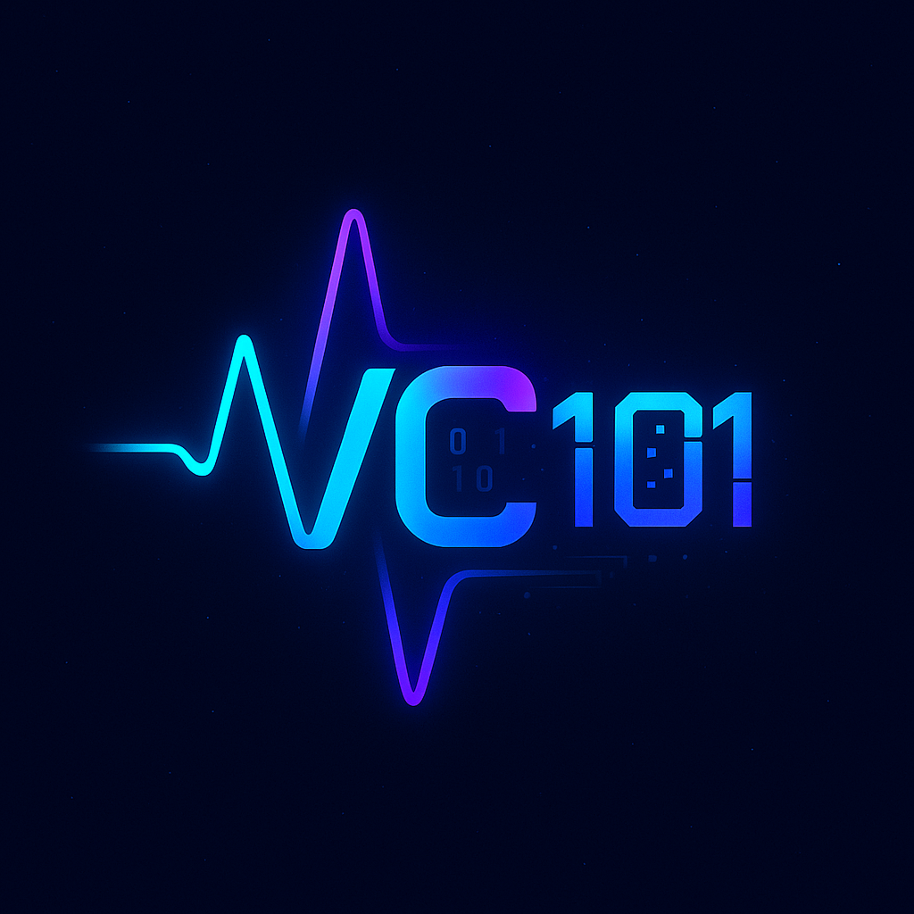

# VC101

<div align="center">
  
</div>

<h1 align="center">VC101 - Vibe Coding 101</h1>

<p align="center">
  <strong>"Code with the Vibe, Build with the Future."</strong>
</p>

<p align="center">
  与 AI 共鸣，创未来代码 | 全球领先的 Human-AI 协同编程社区
</p>

<p align="center">
  <a href="#关于我们"><strong>关于我们</strong></a> ·
  <a href="#核心功能"><strong>核心功能</strong></a> ·
  <a href="#本地开发"><strong>本地开发</strong></a> ·
  <a href="#加入社区"><strong>加入社区</strong></a>
</p>

## 关于我们

VC101 是一个专注于 Human-AI 协同编程的社区平台。我们不只关注代码，更关注开发者与 AI 助手（Claude、Gemini、Copilot 等）之间的"Vibe"（感觉、默契、协同流程）。

### 核心目标

- 🔗 **连接 (Connect)** - 连接对 AI 编程充满热情的开发者，形成活跃互助的社群
- 🚀 **创造 (Create)** - 激励并展示社区成员利用 AI 开发的创新工具、项目和解决方案  
- 📚 **分享 (Share)** - 成为 AI 编程领域前沿知识、最佳实践和实用资源的首选集散地
- 💪 **赋能 (Empower)** - 通过黑客松、资源对接等活动，为开发者提供成长和展示的平台

### 目标用户

- **AI 早期采纳者** - 喜欢尝试最新 AI 模型的开发者，热衷探索 Prompt Engineering
- **工具开发者/独立黑客** - 为 AI 工具链开发增强插件、效率工具，并乐于分享
- **学生与初学者** - 希望快速学习如何利用 AI 提升编程学习效率的年轻开发者
- **企业开发者/技术主管** - 探索如何将 AI 编程范式引入团队，提高整体研发效能

## 核心功能

### 🧠 Vibe 洞见 (Insights)
AI 编程领域的深度分析文章，支持 Markdown 格式和代码高亮，涵盖 Prompt 技巧、工具评测、项目实战等内容。

### 🔧 开发者军火库 (Arsenal)  
精心策划的 AI 编程工具和资源集合，提供详细介绍、下载方式、评分系统，支持按 AI 模型和工具类别筛选。

### 🏆 Vibe 任务 (Quests)
定期举办的黑客松活动，展示优秀项目和获胜团队，形成开发者"荣誉殿堂"。

### 🌐 生态伙伴 (Ecosystem)
展示与 AI 编程相关的公司、产品和 API，帮助开发者快速了解和选型。

## 本地开发

1. 克隆项目
```bash
git clone https://github.com/the-vc101/vc101.git
cd vc101
```

2. 安装依赖
```bash
pnpm install
```

3. 启动开发服务器
```bash
pnpm dev
```

访问 http://localhost:3000 查看网站。

## 加入社区

- 🔗 **GitHub**: [github.com/the-vc101](https://github.com/the-vc101)
- 💬 **微信社群**: 扫码加入我们的微信群
- 📧 **邮箱**: contact@vc101.com

## 技术栈

- **前端**: Next.js (latest) + React
- **样式**: Tailwind CSS + Shadcn/UI  
- **内容**: Markdown 渲染 + 语法高亮
- **部署**: Vercel

## 贡献

欢迎提交 Issue 和 Pull Request！我们特别欢迎：

- 优质的 AI 编程文章投稿
- 实用的开发工具推荐
- 社区功能建议和改进
- Bug 修复和性能优化

## 许可

MIT License © 2025 [VC101](https://github.com/the-vc101)
